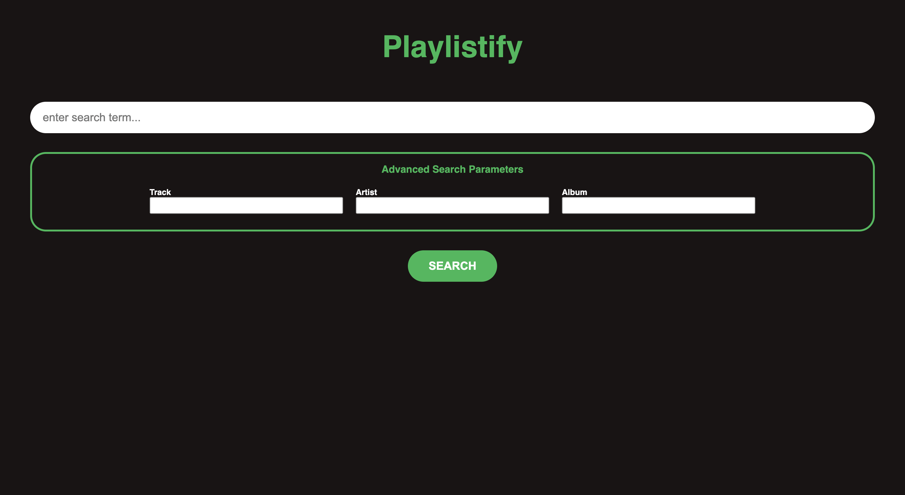
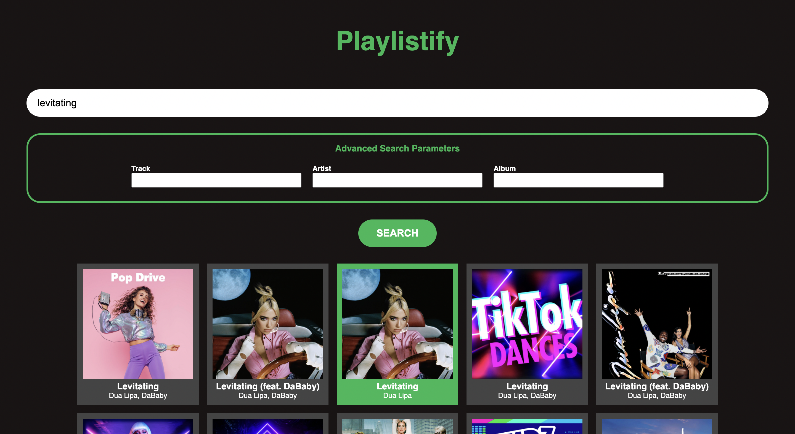
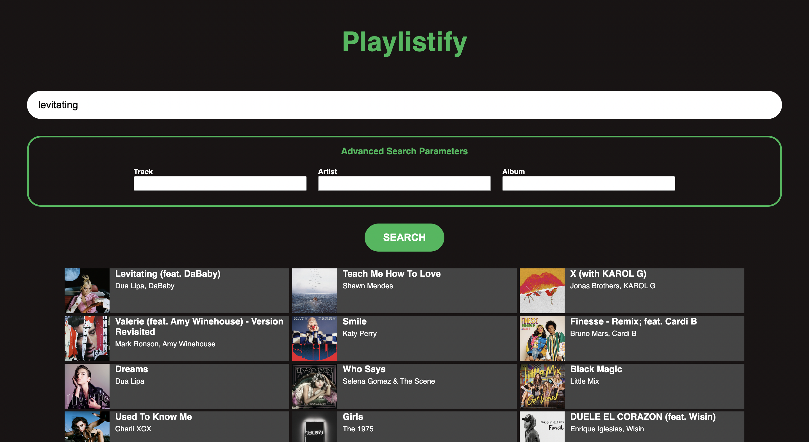
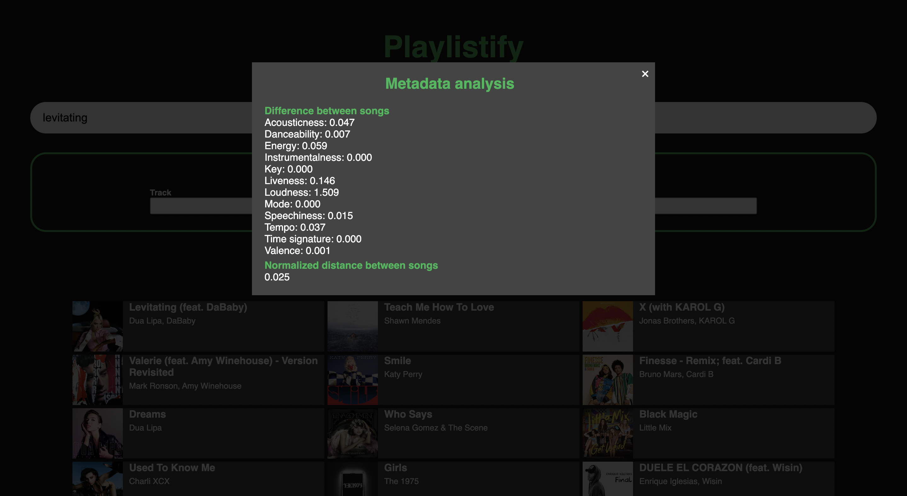

# Playlistify

## About
Playlistify is a web application that suggests playlists based on a single song. Instead of using metrics such as listening history to do this, the algorithm selects songs based on sonic qualities (e.g. tempo, danceability, acousticness, etc.) to provide more similar song recommendations than the current playlist suggestion feature in Spotify.

## How to run
1. In order to run this application, you must have a [Spotify for Developers](https://developer.spotify.com) account. If you do not have an account, you can create a free account using your Spotify credentials.
2. Create a new application.
3. On the application dashboard, add ```http://127.0.0.1:5500/index.html``` as a redirect URL (unless you are using a different port).
4. Copy the Client ID and Client Secret strings from the dashboard into the consts in the ```client.js``` file.
5. Launch the application locally in a browser using the same port specified in the redirect URL.

## Example
After authorizing the Spotify API, the home page should look like this:


This is an example of the search results page:


After clicking on a song card from the search, the user is provided with a list of recommendations:


By clicking on a song, the user can see metadata about the sonic differences between the seed song and the recommended song:


## Credits
This project is authored by James Karsten in 2022. The framework for getting the access token was based off of [this repository](https://github.com/makeratplay/SpotifyWebAPI.git).